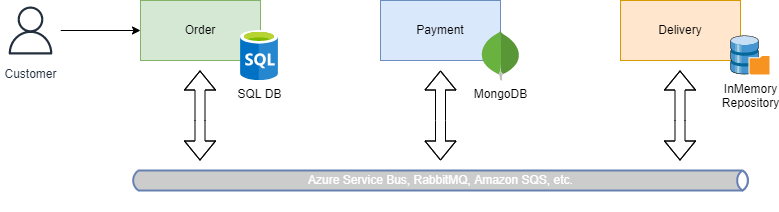
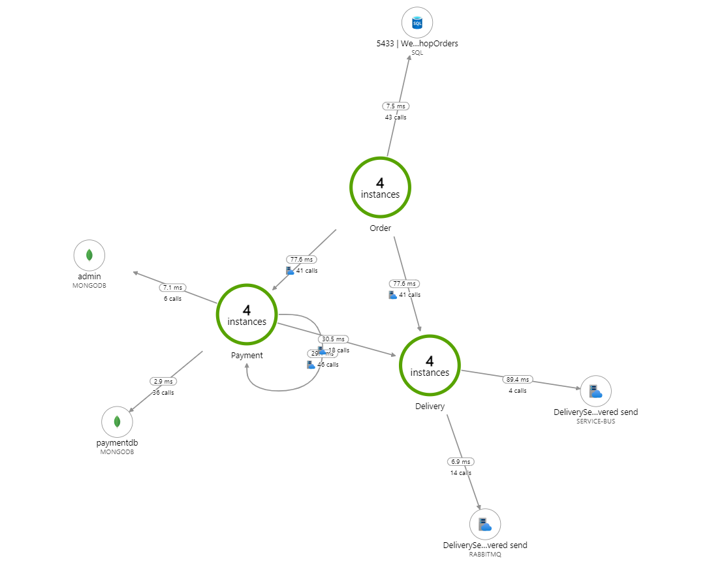

## Overview

`Studi.SimpleWebshopOrder.Distributed` is an intricate webshop order management system designed to showcase the power and challenges of distributed systems in a realistic e-commerce setting. It's a microservices-based system that utilizes `MassTransit` for asynchronous communication between services.



Here's a breakdown:

1. **Order Service:** Initiates the entire order process. When an order is created, it's persisted to a SQL database using EntityFramework. After saving, an `OrderCreated` event is published using MassTransit to notify other services of the new order.

2. **Payment Service:** Handles the payment process. Upon receiving the `OrderCreated` event, it initializes the `PaymentStateMachine` to manage the payment flow. This service uses MongoDB for maintaining the state of payments.

3. **Delivery Service:** Responsible for delivering ordered items once a payment succeeds. This service consumes the `OrderCreated` and `OrderPaymentSucceeded` events. It uses an in-memory store, structured with the Repository Pattern, to maintain a list of orders.

The system demonstrates a real-world scenario where the Order, Payment, and Delivery services collaborate asynchronously to ensure orders are processed, paid for, and delivered seamlessly.

## Project Structure & Key Features

The project is structured around three main services: Order, Payment, and Delivery. Here's a deeper dive into the key features and how they operate:

### Order Service

- **Controller:** The `OrdersController` manages various API endpoints related to order processing. Key methods include:
  - `GetAllOrders()`: Fetches all orders.
  - `GetOrder(Guid id)`: Retrieves a specific order by its ID.
  - `Create(Order order)`: Persists an order to the database and then publishes an `OrderCreated` event.
  - `CreateRandom()`: Generates a random order using the `Faker` library and proceeds as the `Create` method.

- **Data Models:**
  - `Order`: Represents an order with properties like ID, CustomerId, and a list of OrderItems.
  - `OrderItem`: Represents individual items in an order. Contains ArticleId, ArcticleTitle, Price, and Quantity.

### Payment Service

- **State Machine (`PaymentStateMachine`):** Manages the payment process with states like `PaymentPending`, `PaymentSuccessful`, and `PaymentFailed`. It listens for events like `OrderCreated`, `OrderPaymentFailed`, and `OrderPaymentSucceeded` to transition between states.

### Delivery Service

- **Repository (`OrderRepository`):** Utilizes the Repository Pattern and maintains an in-memory store of the orders. Provides methods like `AddOrderAsync` and `GetOrderByIdAsync`.

- **Consumer (`DeliverOrderConsumer`):** Consumes the `OrderPaymentSucceeded` event. Once an order's payment is successful, it simulates the collection of ordered items, logs the collected items, and then publishes an `OrderDelivered` event.

### Cross-Service Features

- **Event-Driven Architecture:** The system leverages `MassTransit` for publishing and consuming events across services. Events like `OrderCreated` drive the flow of data and operations from one service to the next, enabling asynchronous and decoupled interactions.

### Databases

- **OrderService**: Uses EntityFramework for order management.
- **PaymentService**: Leverages MongoDB for maintaining the payment state.
- **DeliveryService**: Implements a Repository Pattern with an in-memory store for orders.

## Initial Configuration

To ensure that the project runs smoothly, we've containerized some services using Docker. Here's how to get everything up and running:

### Prerequisites

1. **Docker**: Make sure you have Docker installed on your system. If not, [download Docker](https://www.docker.com/products/docker-desktop) and follow the installation instructions for your OS.

2. **Docker Compose**: Docker Desktop for Windows and Mac includes Compose out-of-the-box, but if you're on Linux, you might need to [install it separately](https://docs.docker.com/compose/install/).

### Setup Steps

1. **Navigate to the project root**: Using your terminal or command prompt, navigate to the directory containing the `docker-compose.yml` file.

2. **Run Docker Compose**: To start the containers defined in `docker-compose.yml`, run the following command: `docker-compose up -d`

This command will start the following services:

- `sqldata`: A SQL Server container for storing orders.
- `mongodb`: A MongoDB container for the payment service.
- `mongo-express`: A web-based MongoDB admin interface.
- `rabbitmq`: A messaging broker required for MassTransit.
- `jaeger`: A distributed tracing system.

3. **Verify the Services**:
You can check the running containers and their status using: `docker ps`
Additionally, you can access the following interfaces in your browser to verify the services:

- Mongo Express: `http://localhost:8081/`
- RabbitMQ Management: `http://localhost:15672/` (guest:guest)
- Jaeger UI: `http://localhost:16686/`

4. **Setting Up Visual Studio**:

- Open the solution in Visual Studio.
- Right-click on the solution in Solution Explorer
- Choose "Set StartUp Projects".
- Select "Multiple startup projects".
- Ensure that the `OrderService`, `PaymentService`, and `DeliveryService` projects are all set to "Start".

5. **Stop the Services**:
When you're done, you can stop the services by navigating to the directory containing the `docker-compose.yml` file and running:`docker-compose down`

That's it! Your environment should now be correctly set up, and you're ready to run and test the solution.

## Getting Started

Now that your environment is set up, you're ready to run the solution and familiarize yourself with its capabilities. Here's a step-by-step guide to help you get started:

### 1. **Start the Services**

Before you proceed, ensure all Docker services (`sqldata`, `mongodb`, `rabbitmq`, etc.) are up and running. If you've followed the initial configuration, you should be good to go.

### 2. **Running the Solution**

- **Visual Studio**:
  - Simply press `F5` or click the "Start" button in Visual Studio. This should run all the microservices (`OrderService`, `PaymentService`, and `DeliveryService`).

### 3. **Creating Orders**

There are two ways to initiate an order:

#### 1. Manually Creating an Order

You can use Postman or any other API testing tool to make a POST request: `POST https://localhost:7088/Orders`

With the following sample JSON payload:

```json
{
  "id": "{{$guid}}",
  "customerId": "{{$guid}}",
  "items": [
    {
      "articleId": "{{$guid}}",
      "arcticleTitle": "Notebook",
      "price": 856.5,
      "quantity": 2
    },
    {
      "articleId": "{{$guid}}",
      "arcticleTitle": "Docking Station",
      "price": 69.98,
      "quantity": 2
    }
  ]
}
```

#### 2. Creating a Random Order

`POST https://localhost:7088/Orders/Random`

## Tasks

To further deepen your understanding of the solution and its interdependencies, here are some hands-on tasks for you to complete:

### **Task 1: Dive Deep into the Solution**

- Familiarize yourself with the solution structure and the core services (`OrderService`, `PaymentService`, `DeliveryService`).
- Create orders using both methods provided (`/Orders` and `/Orders/Random`).
- Observe the flow of the order across services using distributed tracing in Jaeger.

### **Task 2: Debugging the Delivery Service**

- Start the application but refrain from starting the `DeliveryService`.
- Create several orders.
- Now, initiate the `DeliveryService`.
- Notice that the service output consistently displays `!!!!UNBEKANNT!!!!` for the collected items.

  ```csharp
  public async Task Consume(ConsumeContext<OrderPaymentSucceeded> context)
  {
      ...
      var order = await this.orderRepository.GetOrderByIdAsync(context.Message.OrderId);
      var itemsListText = order is null
          ? "!!!!UNBEKANNT!!!!"
          : string.Join("\n", order.Items.Select(i => $"{i.Quantity,2}x  {i.ArticleTitle,-30} {i.PriceTotal,8:n2}"));
      ...
  }
  ```

- Why is that the case? Dive into the code of the `DeliverOrderConsumer` class and investigate the reason behind this behavior.

- Create a solution for that problem.

### **Task 3: Implement Payment Retry Mechanism**

The payment process occasionally fails at random. Your task is to implement a retry mechanism to address this:

- Familiarize yourself with the `ProcessOrderPaymentConsumer` class. Notice the random failure condition.

  ```csharp
  public async Task Consume(ConsumeContext<OrderCreated> context)
  {
      ...
      var failed = Random.Shared.Next(1, 100) % 2 == 1;
      ...
  }
  ```

- Implement the retry mechanism in the `PaymentStateMachine` where it's commented as `// TODO: Add Retry behavior`.

  ```csharp
  During(PaymentPending,
      When(PaymentFailedEvent)
          .TransitionTo(PaymentFailed), // TODO: Add Retry behavior
      ...
  );
  ```

- Consider exit conditions for payment retries. For instance, how many retries should be attempted before a permanent failure? What delay should exist between retries?

## Metrics & Tracing

In distributed systems, monitoring the performance and health of the services becomes crucial. Metrics provide numerical data that can be analyzed over time, such as the number of requests processed or the average response time. Traces offer insights into the flow of requests through the system.

### Finding Traces in Jaeger

To view traces:

1. Navigate to the [Jaeger UI](http://localhost:16686).
2. Select the desired service (Order, Payment, or Delivery) from the dropdown.
3. Click on "Find Traces" and explore the trace details.

### ApplicationInsights Map

